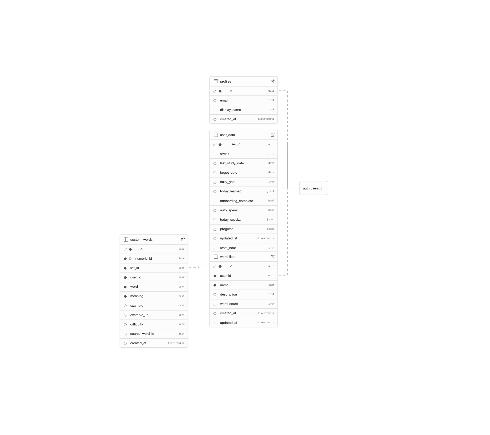

# 데이터베이스 스키마

> Supabase (PostgreSQL) 기반. 최종 업데이트: 2026-02-24

---

## 스키마 다이어그램



모든 테이블은 `auth.users.id`를 FK로 참조하며, ON DELETE CASCADE 적용.

---

## 테이블 설명

### profiles (1:1)

가입 시 트리거(`handle_new_user`)로 자동 생성되는 사용자 프로필.

### user_data (1:1)

학습의 핵심 데이터. 스트릭, 목표, 설정값은 일반 컬럼으로, 복잡한 학습 진도(`progress`)와 세션 정보(`today_session`)는 JSONB로 저장.

- **progress**: 단어별 학습 상태 (`status`, `correctCount`, `wrongCount`, `nextReview`, `interval`, `bookmarked`)
- **today_session**: 오늘의 학습 세션 (`date`, `wordIds`, `currentIndex`, `completed`)

### word_lists (1:N)

사용자가 만드는 커스텀 단어장 메타데이터. `word_count`로 단어 수를 캐싱.

### custom_words (N:1 → word_lists)

단어장에 속한 개별 단어. `numeric_id`(10000~)는 기본 GRE 단어 ID와 충돌하지 않도록 시퀀스로 생성. `source_word_id`는 기본 단어에서 복사한 경우 원본 ID를 참조.

---

## FK CASCADE 정책

| FK | ON DELETE |
|----|----------|
| profiles.id → auth.users | CASCADE |
| user_data.user_id → auth.users | CASCADE |
| word_lists.user_id → auth.users | CASCADE |
| custom_words.user_id → auth.users | CASCADE |
| custom_words.list_id → word_lists | CASCADE |

---

## RLS (Row Level Security)

모든 테이블에 RLS 활성화. 사용자는 자신의 데이터만 CRUD 가능.

| 테이블 | SELECT | INSERT | UPDATE | DELETE |
|--------|--------|--------|--------|--------|
| profiles | O | O | O | - |
| user_data | O | O | O | - |
| word_lists | O | O | O | O |
| custom_words | O | O | O | O |

---

## 계정 삭제 흐름

코드 명시 삭제 + DB CASCADE 이중 안전망. (`AuthContext.deleteAccount()`)

```
1. custom_words 삭제  (FK 의존성 때문에 먼저)
2. word_lists 삭제
3. user_data 삭제
4. rpc("delete_user") → auth.users 삭제
   └── CASCADE로 잔여 데이터 자동 정리 (안전망)
5. 로그아웃
```

---

## TypeScript 타입 매핑

DB snake_case ↔ 프론트 camelCase 변환: `useUserData.ts`, `useWordLists.ts`

| DB 컬럼 | TS 필드 | 타입 |
|---------|---------|------|
| `user_data.daily_goal` | `UserData.dailyGoal` | number |
| `user_data.reset_hour` | `UserData.resetHour` | number |
| `user_data.today_learned` | `UserData.todayLearned` | string[] |
| `user_data.last_study_date` | `UserData.lastStudyDate` | string |
| `user_data.onboarding_complete` | `UserData.onboardingComplete` | boolean |
| `user_data.auto_speak` | `UserData.autoSpeak` | boolean |
| `user_data.today_session` | `UserData.todaySession` | TodaySession |
| `custom_words.numeric_id` | `CustomWord.numericId` | number |
| `custom_words.list_id` | `CustomWord.listId` | string |
| `custom_words.example_ko` | `CustomWord.exampleKo` | string |
| `custom_words.source_word_id` | `CustomWord.sourceWordId` | number \| null |
| `word_lists.word_count` | `WordList.wordCount` | number |
| `word_lists.created_at` | `WordList.createdAt` | string |
| `word_lists.updated_at` | `WordList.updatedAt` | string |
