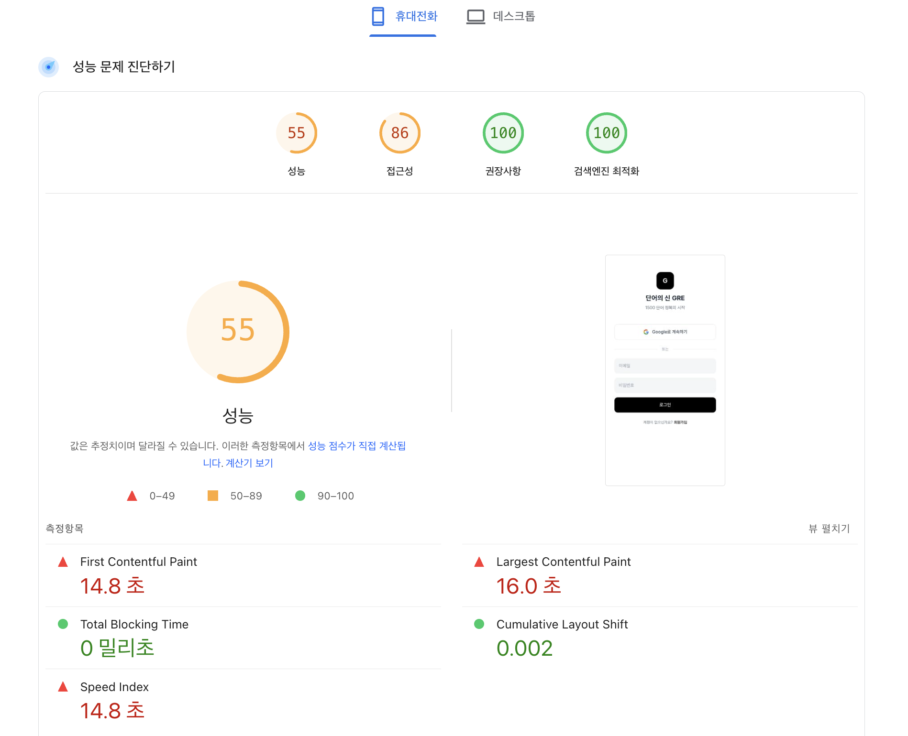
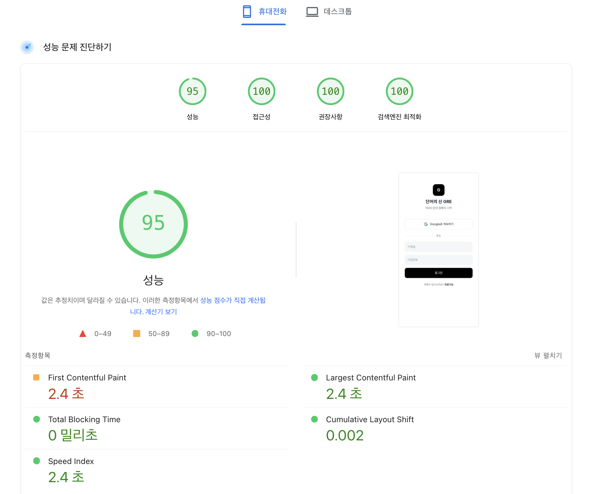

# 성능 최적화 (Performance Optimization)

2026-01-24 적용된 최적화 내용 정리.

## 📊 결과 요약

### Before



### After



| 지표            | Before | After     | 개선   |
| --------------- | ------ | --------- | ------ |
| **성능 점수**   | 55     | **95**    | +40 🚀 |
| **FCP**         | 14.8초 | **2.4초** | -84%   |
| **LCP**         | 16.0초 | **2.4초** | -85%   |
| **Speed Index** | 14.8초 | **2.4초** | -84%   |
| **접근성**      | 86     | **100**   | +14    |

| 최적화                  | 효과                      | 영향 지표         |
| ----------------------- | ------------------------- | ----------------- |
| HTML 사전 렌더링        | LCP 즉시 표시             | LCP, FCP          |
| Firestore 지연 로딩     | 초기 번들 62% 감소        | TBT, Speed Index  |
| Firebase Auth 지연 로딩 | Auth SDK 78KB 지연 로드   | TBT, Speed Index  |
| 코드 스플리팅           | 페이지별 청크 분리        | TBT               |
| Vendor 청크 분리        | 라이브러리 캐시 최적화    | Speed Index       |
| DNS Prefetch/Preconnect | 연결 시간 ~500ms 절약     | FCP, LCP          |
| 폰트 비동기 로딩        | 렌더 블로킹 제거          | FCP               |
| 캐시 헤더 설정          | 재방문 시 즉시 로드       | Speed Index       |

---

## 핵심 최적화 (High Impact)

### 1. HTML 사전 렌더링 - LCP 즉시 표시

**효과: LCP 2,520ms → ~0ms**

**문제:** React 앱은 JS가 로드되고 실행된 후에야 화면에 콘텐츠가 표시됨. 느린 네트워크에서 사용자는 빈 화면을 오래 보게 됨.

**해결:** LCP(Largest Contentful Paint) 요소인 로고와 제목을 HTML에 직접 작성. JS 로드 전에 브라우저가 즉시 렌더링함:

```html
<!-- index.html -->
<div id="root">
  <!-- JS 로드 전 즉시 표시 -->
  <main style="min-height:100vh;background:#fff;padding:48px 20px;...">
    <div style="width:64px;height:64px;background:#000;...">
      <span style="color:#fff;font-size:24px;font-weight:700">G</span>
    </div>
    <h1 style="font-size:24px;font-weight:700;...">단어의 신 GRE</h1>
    <p style="color:#6b7280;...">1500 단어 정복의 시작</p>
  </main>
</div>
```

React hydration 시 자동 교체됨.

---

### 2. Firestore 지연 로딩 - 초기 번들 62% 감소

**효과: 초기 번들 512KB → 194KB**

**문제:** `useUserData` 훅이 항상 호출되어, 로그인하지 않은 사용자도 Firestore SDK(325KB)를 다운로드해야 했음.

**해결:** 로그인 체크와 데이터 로딩을 분리. `AuthenticatedApp` 컴포넌트를 lazy로 분리하여 로그인 후에만 Firestore가 로드됨:

```tsx
// App.tsx
const AuthenticatedApp = lazy(() => import("@/components/AuthenticatedApp"));

function ProtectedRoutes() {
  const { user } = useAuth();

  if (!user) return <Login />; // Firestore 로드 안함

  return (
    <Suspense fallback={<PageLoader />}>
      <AuthenticatedApp userId={user.uid} /> {/* 로그인 후에만 로드 */}
    </Suspense>
  );
}
```

| 청크             | Before | After  |
| ---------------- | ------ | ------ |
| index.js (초기)  | 512 KB | 194 KB |
| AuthenticatedApp | -      | 319 KB |

---

### 3. Firebase Auth 지연 로딩

**효과: Auth SDK 78KB 초기 로드에서 제외**

**문제:** Firebase Auth SDK(78KB)가 앱 시작 시 즉시 로드됨. 첫 방문자는 로그인 여부와 관계없이 이 비용을 지불.

**해결:** Auth SDK를 동적 import로 변경. 로그인 버튼 클릭 시에만 로드. 이전에 로그인한 사용자는 localStorage 체크로 자동 초기화:

```typescript
// firebase.ts
export const getAuthLazy = async (): Promise<Auth> => {
  if (!authInstance) {
    const { getAuth } = await import("firebase/auth");
    authInstance = getAuth(app);
  }
  return authInstance;
};
```

재방문 사용자는 localStorage로 자동 초기화:

```typescript
useEffect(() => {
  if (localStorage.getItem("wasLoggedIn")) {
    initializeAuth();
  }
}, []);
```

---

### 4. Auth 로딩 중 Login 즉시 표시

**효과: FCP 즉시 발생**

**문제:** 기존에는 Firebase Auth 응답을 기다리는 동안 스피너를 표시. 느린 네트워크에서 13초+ 대기.

**해결:** Auth 로딩 중에도 `user`가 null이면 즉시 Login 페이지 표시. 대부분의 첫 방문자(비로그인)는 즉시 화면을 봄. 이미 로그인된 사용자는 잠깐 Login 화면이 보였다가 자동으로 홈으로 이동:

```tsx
// Before: 스피너 표시 → FCP 지연
if (authLoading) return <Spinner />;

// After: Login 즉시 표시 → FCP 즉시
if (!user) return <Login />;
```

---

## 기타 최적화

### 코드 스플리팅

React의 `lazy`와 `Suspense`를 사용해 각 페이지를 별도 청크로 분리. 사용자가 해당 페이지에 방문할 때만 코드를 다운로드:

```tsx
const StudyPage = lazy(() => import("@/pages/StudyPage"));
```

### Vendor 청크 분리

라이브러리(React, Firebase)와 앱 코드를 분리. 라이브러리는 버전이 바뀌지 않는 한 브라우저 캐시를 유지하므로, 앱 업데이트 시 앱 코드만 다시 다운로드:

```typescript
// vite.config.ts
manualChunks: {
  "vendor-react": ["react", "react-dom", "react-router-dom"],
  "vendor-firebase": ["firebase/app", "firebase/firestore"],
}
```

### DNS Prefetch & Preconnect

브라우저가 Firebase API 서버에 미리 연결을 설정. 실제 요청 시 DNS 조회 + TCP/TLS 핸드셰이크 시간(~500ms) 절약:

```html
<link rel="preconnect" href="https://firestore.googleapis.com" crossorigin />
```

### 폰트 비동기 로딩

폰트 CSS를 `preload`로 미리 다운로드하되, 렌더링을 차단하지 않음. 폰트가 늦게 로드되어도 시스템 폰트로 먼저 텍스트 표시:

```html
<link rel="preload" href="...pretendard.css" as="style" onload="this.rel='stylesheet'" />
```

### 캐시 헤더 (vercel.json)

JS, CSS 등 정적 파일에 1년 캐시 설정. Vite가 파일 내용 변경 시 해시를 바꾸므로 캐시 무효화 걱정 없음:

```json
{ "headers": [{ "source": "/assets/(.*)", "headers": [{ "key": "Cache-Control", "value": "public, max-age=31536000, immutable" }] }] }
```

---

## 번들 크기 비교

최적화 전에는 모든 코드가 하나의 1MB 번들에 포함되어 있었음. 이제는 필요한 시점에 필요한 코드만 로드:

| 구분             | Before   | After                   |
| ---------------- | -------- | ----------------------- |
| 메인 번들        | 1,015 KB | **194 KB** (로그인)     |
| AuthenticatedApp | -        | 319 KB (로그인 후 로드) |
| vendor-react     | -        | 47 KB (캐시)            |
| vendor-firebase  | -        | 325 KB (로그인 후 로드) |

**로딩 시나리오:**

```
비로그인 첫 방문:  194 + 47 + 40 = 281 KB
로그인 후:         319 + 325 = 644 KB 추가
재방문:            캐시 히트 → ~0 KB
```

---

## 측정 도구

| 도구               | 용도           | URL               |
| ------------------ | -------------- | ----------------- |
| PageSpeed Insights | 성능 점수 측정 | pagespeed.web.dev |
| Lighthouse         | 상세 성능 분석 | Chrome DevTools   |
| Bundlephobia       | 패키지 크기    | bundlephobia.com  |
