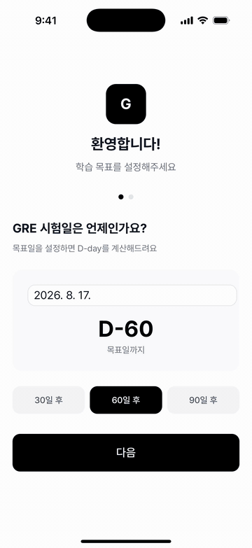

# GRE Vocab Master

A full-stack vocabulary learning platform designed to help GRE test-takers master 1,560 high-frequency words through spaced repetition, quizzes, and progress tracking.

Available on both **Web** and **iOS**.

[](https://apps.apple.com/app/id6758345755)

<p align="center">
  
</p>

---

## Overview

GRE Vocab Master was built to make GRE vocabulary learning more effective and engaging.

The platform combines flashcards, quizzes, progress tracking, and pronunciation support into a single learning experience, helping users retain vocabulary through active recall and repeated exposure.

---

## Why I Built This

While preparing for graduate school applications in the United States, I found that traditional vocabulary lists were difficult to retain and lacked an effective review workflow.

To solve this problem, I built GRE Vocab Master — a cross-platform learning application that helps learners systematically study and review GRE vocabulary through spaced repetition and personalized progress tracking.

---

## Architecture

```
User
  │
  ▼
React + TypeScript
  │
  ├── Supabase Auth
  ├── PostgreSQL Database
  ├── Sentry (error tracking)
  │
  ▼
Vercel Serverless Functions
  │
  ▼
Google Cloud Text-to-Speech
```

---

## Key Features

### Vocabulary Learning

1,560 curated GRE words via flashcard-based active recall, with randomized sessions to prevent positional memorization.

### Quiz System

Fill-in-the-blank and multiple-choice quizzes built for retention-focused review.

### Progress Tracking

Daily goals, learning streaks, and per-word mastery statistics.

### Pronunciation Support

Real-time playback via Google Cloud Text-to-Speech, with the Web Speech API as a fallback.

### Cross-Platform Experience

Native iOS app via Capacitor, plus the web build as a PWA.

---

## Impact

Real-world outcomes from building, shipping, and operating GRE Vocab Master in production.

- **~30 active iOS users** — small enough to know each, large enough to surface bugs that synthetic tests miss.
- **User-reported regex bug → English-morphology-aware fix.** A learner emailed a screenshot showing the answer (`harrow`) appearing verbatim in `...harrowed the viewers`. The blank-fill quiz was using `\bword\b` exact-match, blind to English inflection. I rebuilt the matcher in [`src/lib/blankSentence.ts`](./src/lib/blankSentence.ts) to handle four morphology families — `-ed/-ing/-ation`, `y → i`, silent-`e` drop, consonant doubling — moving blank-quiz coverage from **80% → 99.9%** across all 1,560 words. Shipped as v1.4 the same day. ([postmortem](./.ai/OPERATIONS_LOG.md))
- **6 versions shipped** (1.0 → 1.6) over 5 months — every release tied to a user-facing feature or an incident postmortem.
- **1,560 curated GRE words** localized in **English + Korean**, with native iOS metadata and screenshots in both locales.
- **5 production issues investigated and resolved**, each documented with root cause analysis and lessons learned in [`.ai/OPERATIONS_LOG.md`](./.ai/OPERATIONS_LOG.md).
- **Production observability** via Sentry on web + iOS — a TypeError (`undefined is not an object`) surfaced through the weekly digest within 7 days and shipped as version 1.5.

---

## Tech Stack

### Frontend

- React 19
- TypeScript
- Vite
- Tailwind CSS
- React Router

### Backend & Infrastructure

- Supabase Authentication
- PostgreSQL
- Vercel Serverless Functions

### External Services

- Google Cloud Text-to-Speech

### Mobile

- Capacitor

---

## Technical Challenges & Learnings

### Cross-Platform Development

Supporting both web and iOS from a single codebase required careful separation of platform-specific functionality while maintaining a consistent user experience.

### Serverless API Design

To prevent exposing Google Cloud credentials on the client, a Vercel Serverless Function was implemented as a secure proxy layer between the frontend and Google Cloud TTS services.

### Learning Experience Design

One of the key challenges was designing a study workflow that balanced introducing new vocabulary while reinforcing previously learned words.

The application uses spaced repetition concepts and quiz-based reinforcement to encourage long-term retention.

### Scalable Frontend Architecture

As the application grew, maintaining predictable state and reusable UI patterns became increasingly important. The project emphasized component reusability, type safety, and maintainable frontend architecture.

---

## What I Learned

Through building and operating GRE Vocab Master, I gained hands-on experience in:

- **Cross-platform development with React + Capacitor** — sharing a single codebase across Web PWA and iOS, with platform-specific code (Apple Sign-In, Capacitor plugins) cleanly isolated.
- **Production monitoring and incident response with Sentry** — weekly-digest cadence across web and iOS, with every incident closed via a postmortem in [`.ai/OPERATIONS_LOG.md`](./.ai/OPERATIONS_LOG.md).
- **Secure serverless API design** — a Vercel Function proxy keeps Google Cloud TTS credentials off the client, with the Web Speech API as a graceful fallback.
- **PostgreSQL access control with Supabase Row-Level Security** — designed per-user RLS policies and learned the hard way that missing ones fail silently (see [`ARCHITECTURE.md §3.4`](./ARCHITECTURE.md)).
- **Designing learning systems around real user feedback** — a single user email reshaped the quiz regex; inflection-aware matching pushed coverage from **80% → 99.9%** across all 1,560 words.

---

## AI-Augmented Engineering Workflow

[Claude Code](https://claude.com/claude-code) is wired into this project as a system, not autocomplete — persistent context, custom workflows, and an incident-driven feedback loop.

- **Central docs ([`.ai/`](./.ai/), ~2,700 lines)** — single source of truth across sessions. Includes [`ARCHITECTURE.md`](./ARCHITECTURE.md) (system invariants distilled from past incidents) and [`.ai/OPERATIONS_LOG.md`](./.ai/OPERATIONS_LOG.md) (production postmortems).
- **Custom slash commands** — `/commit` gates commits behind type-check + review + TODO sync. `/oplog`, `/todo`, `/wrap` standardize routine writes.
- **Specialized sub-agent** — i18n workstream runs in an isolated agent with blocking prerequisites and doc-update obligations, preventing drift between code and plan.
- **Incident → invariant loop** — every production bug ships with a postmortem _and_ an architectural invariant to prevent recurrence. Example (2026-06-18): an RLS audit found `user_data.delete()` was a silent no-op due to a missing policy; the fix landed as a migration + ops-log entry + new `ARCHITECTURE.md §3.4` invariant in one coherent change.

The leverage isn't speed — it's discipline. Every decision lands in a reviewable artifact.

---

## Local Development

### Prerequisites

- Node.js 20+
- npm

### Installation

```bash
git clone https://github.com/soojjung/gre-vocab-master.git
cd GRE
nvm use
npm install
npm run dev
```

### Environment Variables

```bash
VITE_SUPABASE_URL=
VITE_SUPABASE_ANON_KEY=
GOOGLE_TTS_API_KEY=
```

---

## License

This project was created for educational and personal learning purposes.

### Vocabulary Sources

- [Manhattan Prep 1000 GRE Words](https://www.manhattanprep.com/gre/)
- [Target Test Prep GRE Vocabulary](https://gre.blog.targettestprep.com/gre-vocabulary/)
